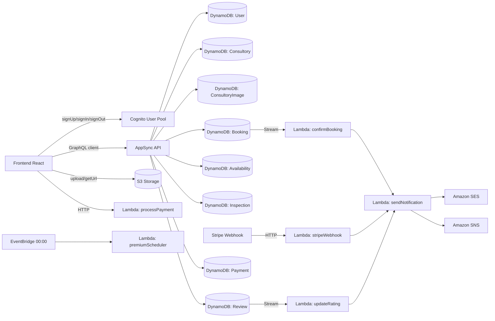
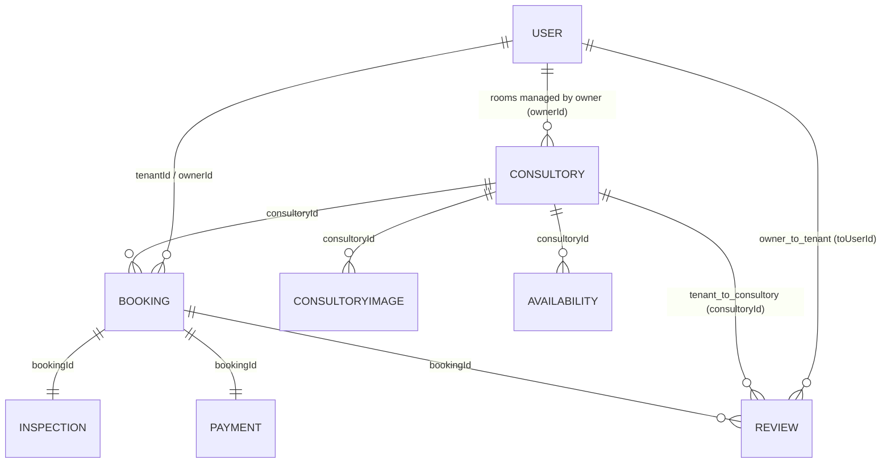

# AlugFacil - Mapa Completo do Backend (AWS Amplify Gen2)

Data de referencia: 2026-05-06

## 1) Objetivo deste documento

Este arquivo concentra todo o mapa do backend do AlugFacil em um unico lugar:

- Arquitetura backend (Amplify Gen2)
- Autenticacao (Cognito)
- Dados (AppSync + DynamoDB)
- Storage (S3)
- Lambdas de negocio
- Notificacoes (SES/SNS)
- Fluxos end-to-end
- CI/CD e deploy
- Custos iniciais e ordem recomendada de implementacao

## 2) Visao geral do produto (contexto de backend)

AlugFacil e um marketplace B2B de consultorios odontologicos com dois perfis:

- Locatario (Dentista)
- Locador (Proprietario)

Ciclo de vida principal da locacao:

```text
Busca -> Reserva -> Pagamento -> Vistoria (check-in) -> Atendimento -> Vistoria (check-out) -> Avaliacao mutua
```

## 3) Mapa visual da arquitetura backend



## 4) Por que AWS Amplify Gen2

| Tema | Gen1 | Gen2 |
|---|---|---|
| Configuracao | JSON/YAML via CLI | TypeScript puro (`amplify/backend.ts`) |
| Infraestrutura | CloudFormation auto | CDK explicito/customizavel |
| Dev local | `amplify mock` | `ampx sandbox` (nuvem real isolada) |
| Type safety | Codegen separado | Schema -> tipos automaticos |
| Deploy | `amplify push` | `ampx pipeline-deploy` / Amplify Hosting |

Servicos usados no backend AlugFacil:

- Cognito (auth)
- AppSync + DynamoDB (dados)
- Lambda (regras de negocio)
- S3 (arquivos)
- SES/SNS (notificacoes)
- Amplify Hosting (deploy frontend + pipeline backend)

## 5) Setup e bootstrap do backend

### 5.1 Pre-requisitos

```bash
node -v  # >= 18
aws configure
```

### 5.2 Dependencias

```bash
npm add -D @aws-amplify/backend @aws-amplify/backend-cli
npm add aws-amplify
npm add -D @types/node @types/aws-lambda
```

### 5.3 Estrutura base esperada

```text
alugfacil/
├── amplify/
│   ├── backend.ts
│   ├── auth/resource.ts
│   ├── data/resource.ts
│   ├── storage/resource.ts
│   └── functions/
│       ├── processPayment/
│       ├── sendNotification/
│       ├── confirmBooking/
│       ├── updateRating/
│       ├── verifyDocument/
│       ├── premiumScheduler/
│       └── stripeWebhook/
├── src/
└── amplify_outputs.json
```

### 5.4 Composicao do backend

```ts
// amplify/backend.ts
import { defineBackend } from "@aws-amplify/backend";
import { auth } from "./auth/resource";
import { data } from "./data/resource";
import { storage } from "./storage/resource";
import { processPayment } from "./functions/processPayment/resource";
import { sendNotification } from "./functions/sendNotification/resource";
import { confirmBooking } from "./functions/confirmBooking/resource";
import { updateRating } from "./functions/updateRating/resource";
import { verifyDocument } from "./functions/verifyDocument/resource";
import { premiumScheduler } from "./functions/premiumScheduler/resource";

defineBackend({
  auth,
  data,
  storage,
  processPayment,
  sendNotification,
  confirmBooking,
  updateRating,
  verifyDocument,
  premiumScheduler,
});
```

### 5.5 Sandbox dev

```bash
npx ampx sandbox
```

No frontend:

```ts
import { Amplify } from "aws-amplify";
import outputs from "../amplify_outputs.json";

Amplify.configure(outputs);
```

## 6) Autenticacao (Cognito)

### 6.1 O que o Cognito cobre

- Signup/login com email e verificacao
- JWTs (ID/Access/Refresh)
- Grupos: `TENANT`, `OWNER`, `ADMIN`
- Atributos customizados: role, CRO, especialidade, verified
- Integracao de autorizacao com AppSync

### 6.2 Exemplo de configuracao

```ts
import { defineAuth } from "@aws-amplify/backend";

export const auth = defineAuth({
  loginWith: {
    email: {
      verificationEmailStyle: "CODE",
      verificationEmailSubject: "Confirme seu cadastro no AlugFacil",
      verificationEmailBody: (createCode) => `Seu codigo de verificacao: ${createCode()}`,
    },
  },
  userAttributes: {
    email: { required: true, mutable: false },
    phoneNumber: { required: false, mutable: true },
    "custom:role": { dataType: "String", mutable: true },
    "custom:cro": { dataType: "String", mutable: true },
    "custom:specialty": { dataType: "String", mutable: true },
    "custom:verified": { dataType: "String", mutable: true },
  },
  groups: ["TENANT", "OWNER", "ADMIN"],
  passwordPolicy: {
    minLength: 8,
    requireLowercase: true,
    requireUppercase: false,
    requireNumbers: true,
    requireSpecialCharacters: false,
  },
});
```

### 6.3 Fluxo de cadastro com grupo

1. Front chama `signUp`.
2. Usuario confirma email (`confirmSignUp`).
3. Trigger `postConfirmation` adiciona no grupo certo.
4. Sistema cria/garante perfil no model `User`.
5. Sistema pode disparar email de boas-vindas.

## 7) Dados (AppSync + DynamoDB)

### 7.1 Como funciona

```text
Frontend React -> AppSync GraphQL -> Resolvers automaticos -> DynamoDB
```

O schema gera automaticamente:

- CRUD GraphQL
- Tabelas DynamoDB (1 por model)
- GSIs de relacionamentos
- Tipos TypeScript para cliente
- Regras de autorizacao

### 7.2 Relacionamento entre entidades

Regras de dominio (modelo de negocio):

- `Owner` nao e um perfil pessoal publico; ele representa um negocio.
- Cada `Owner` possui **1 consultorio (negocio)**.
- Cada consultorio possui **N salas** disponiveis para locacao.
- O `Owner` gerencia **N salas** na aba **Minhas salas**.
- Avaliacoes de locatario sao feitas para o consultorio/sala.
- Avaliacoes de owner sao feitas para o locatario.

Mapeamento no schema atual:

- O model `Consultory` representa a **sala ofertada**.
- O vinculo "consultorio (negocio) com N salas" e uma regra de dominio; as salas sao os registros operacionais usados em busca, agenda, reserva e precificacao.



### 7.3 Models e papel no dominio

| Model | PK | Relacoes principais | Papel |
|---|---|---|---|
| `User` | `cognitoId` | `Consultory`, `Booking`, `Review` | Conta de acesso (owner = conta do negocio; tenant = perfil profissional) |
| `Consultory` | `id` | `User`, `Booking`, `ConsultoryImage`, `Availability`, `Review` | Sala ofertada para locacao (unidade que recebe avaliacao publica) |
| `ConsultoryImage` | `id` | `Consultory` | Referencias de imagens no S3 |
| `Booking` | `id` | `Consultory`, `User`, `Inspection`, `Review`, `Payment` | Reserva e ciclo de vida |
| `Inspection` | `id` | `Booking` | Check-in/check-out + evidencias |
| `Review` | `id` | `Booking`, `Consultory`, `User` | Avaliacao de locatario para consultorio/sala e de owner para locatario |
| `Payment` | `id` | `Booking` | Registro financeiro |
| `Availability` | `id` | `Consultory` | Agenda de disponibilidade |

### 7.4 Campos importantes por model

- `User`
- `cognitoId`, `name`, `publicSlug`, `email`, `phone`, `role`, `avatarKey`, `taxId`, `cro`, `specialty`, `verified`, `rating`, `totalReviews`

- `Consultory`
- `name`, `publicSlug`, `description`, `neighborhood`, `city`, `state`, `address`, `zipCode`, `latitude`, `longitude`, `pricePerPeriod`, `equipment[]`, `periodMorning`, `periodAfternoon`, `periodEvening`, `featured`, `isPremium`, `premiumUntil`, `rating`, `totalReviews`, `whatsappNumber`, `ownerId`

- `ConsultoryImage`
- `s3Key`, `order`, `consultoryId`

- `Booking`
- `date`, `period`, `status`, `price`, `platformFee`, `ownerAmount`, `reviewedByTenant`, `reviewedByOwner`, `paymentStatus`, `paymentIntentId`, `consultoryId`, `tenantId`, `ownerId`

- `Inspection`
- `type`, `checklistJson`, `photoKeys[]`, `signedAt`, `signedBy`, `bookingId`

- `Review`
- `rating`, `comment`, `type`, `fromUserId`, `toUserId`, `bookingId`, `consultoryId`
- `type=tenant_to_consultory`: avaliacao publica da sala/consultorio
- `type=owner_to_tenant`: avaliacao do locatario

- `Payment`
- `amount`, `platformFee`, `ownerAmount`, `currency`, `provider`, `providerPaymentId`, `providerChargeId`, `status`, `transferId`, `transferredAt`, `bookingId`

- `Availability`
- `consultoryId`, `date`, `period`, `isAvailable`

### 7.5 URLs publicas por slug (tenant e consultorio)

Regra de roteamento no frontend:

- `/profile` e exclusivo para o usuario autenticado (dono da conta).
- `/:slug` e rota publica generica.
- Em `/:slug`, o sistema tenta primeiro resolver `Consultory.publicSlug`.
- Se encontrar consultorio, redireciona para `/consultorios/:id`.
- Se nao encontrar consultorio, tenta resolver `User.publicSlug` de locatario (`TENANT`).
- Se nenhum registro for encontrado, exibe estado de "perfil nao encontrado".

Regra de dominio:

- Owner nao possui pagina publica pessoal em `/:slug`.
- A presenca publica do owner acontece pelo consultorio (slug do consultorio).

Observacoes de slug:

- `publicSlug` e gerado em formato URL-safe.
- Em dados legados sem slug salvo, o sistema usa fallback por nome normalizado e persiste slug ao encontrar o registro.
- Slugs reservados (ex.: `profile`, `consultorios`, `dashboard`, `entrar`) nao devem ser usados para registros publicos.

### 7.6 Autorizacao por model (resumo)

- `User`
- owner no proprio registro
- `ADMIN` com acesso administrativo
- autenticado pode ler
- leitura publica por `apiKey` para lookup de perfil publico por slug

- `Consultory`
- leitura publica por `apiKey`
- owner cria/edita/exclui
- `ADMIN` com acesso administrativo

- `ConsultoryImage`
- leitura publica por `apiKey`
- owner cria/edita/exclui
- `ADMIN` com acesso administrativo

- `Booking`
- owner-based access (tenant/owner conforme regra de identidade)
- `ADMIN` com acesso administrativo

- `Inspection`
- owner-based access
- `ADMIN` com acesso administrativo

- `Review`
- owner e tenant criam conforme ciclo de locacao
- avaliacao de consultorio pode ser lida publicamente
- `ADMIN` com acesso administrativo

- `Payment`
- owner-based access
- `ADMIN` com acesso administrativo

- `Availability`
- leitura publica por `apiKey`
- owner cria/edita/exclui
- `ADMIN` com acesso administrativo

### 7.7 Enums de negocio

- `BookingPeriod`: `MORNING`, `AFTERNOON`, `EVENING`
- `BookingStatus`: `PENDING`, `CONFIRMED`, `CHECKED_IN`, `COMPLETED`, `CANCELLED`, `DISPUTED`
- `PaymentStatus` (Booking): `PENDING`, `PAID`, `REFUNDED`
- `AvailabilityPeriod`: `MORNING`, `AFTERNOON`, `EVENING`
- `InspectionType`: `CHECK_IN`, `CHECK_OUT`
- `ReviewType`: `TENANT_TO_CONSULTORY`, `OWNER_TO_TENANT`
- `PaymentProvider`: `STRIPE`, `PAGARME`
- `PaymentRecordStatus`: `PENDING`, `PROCESSING`, `PAID`, `FAILED`, `REFUNDED`

### 7.8 GSIs recomendados

| Tabela | GSI | Partition Key | Sort Key | Uso |
|---|---|---|---|---|
| Booking | byTenant | tenantId | date | Reservas do dentista |
| Booking | byOwner | ownerId | date | Reservas do proprietario |
| Booking | byConsultory | consultoryId | date | Agenda do consultorio |
| Booking | byStatus | status | date | Operacao admin |
| Consultory | byCity | city | neighborhood | Busca por localizacao |
| Consultory | byOwner | ownerId | createdAt | Consultorios do proprietario |
| Availability | byConsultory | consultoryId | date | Disponibilidade |

### 7.9 Cliente frontend para dados reais

```ts
import { generateClient } from "aws-amplify/data";
import type { Schema } from "../../amplify/data/resource";

export const client = generateClient<Schema>();

export const listConsultories = () =>
  client.models.Consultory.list({ authMode: "apiKey" });

export const createBooking = (input: {
  consultoryId: string;
  date: string;
  period: "MORNING" | "AFTERNOON" | "EVENING";
  price: number;
}) =>
  client.models.Booking.create({
    ...input,
    status: "PENDING",
    paymentStatus: "PENDING",
    reviewedByTenant: false,
    reviewedByOwner: false,
  });
```

## 8) Storage (S3)

### 8.1 Buckets logicos

| Bucket logico | Conteudo | Acesso |
|---|---|---|
| `consultory-images` | Fotos de consultorios | Leitura publica; escrita do dono |
| `inspection-photos` | Fotos de vistoria | Leitura/escrita dos envolvidos |
| `avatars` | Foto de perfil | Leitura publica; escrita do proprio |
| `documents` | CRO/CNPJ/comprovantes | Privado (usuario + admin) |

### 8.2 Politicas de acesso

```ts
import { defineStorage } from "@aws-amplify/backend";

export const storage = defineStorage({
  name: "alugfacilStorage",
  access: (allow) => ({
    "consultory-images/{entity_id}/*": [
      allow.guest.to(["read"]),
      allow.entity("identity").to(["read", "write", "delete"]),
    ],
    "inspection-photos/{entity_id}/*": [
      allow.entity("identity").to(["read", "write", "delete"]),
      allow.groups(["ADMIN"]).to(["read"]),
    ],
    "avatars/{entity_id}/*": [
      allow.guest.to(["read"]),
      allow.entity("identity").to(["read", "write", "delete"]),
    ],
    "documents/{entity_id}/*": [
      allow.entity("identity").to(["read", "write"]),
      allow.groups(["ADMIN"]).to(["read", "write"]),
    ],
  }),
});
```

### 8.3 Operacoes comuns de upload/url

```ts
import { uploadData, getUrl } from "aws-amplify/storage";

export async function uploadConsultoryImage(file: File, consultoryId: string) {
  const key = `consultory-images/${consultoryId}/${Date.now()}-${file.name}`;
  await uploadData({ key, data: file, options: { contentType: file.type } }).result;
  return key;
}

export async function getImageUrl(key: string) {
  const result = await getUrl({ key, options: { expiresIn: 3600 } });
  return result.url.toString();
}
```

## 9) Funcoes Lambda (logica de negocio)

### 9.1 Matriz de funcoes

| Funcao | Trigger | Responsabilidade |
|---|---|---|
| `processPayment` | HTTP (API Gateway) | Criar intent no Stripe e iniciar cobranca |
| `confirmBooking` | DynamoDB Stream (Booking criado) | Notificar proprietario |
| `sendNotification` | Invocacao direta + SES/SNS | Envio de emails/push |
| `updateRating` | DynamoDB Stream (Review criada) | Recalcular medias |
| `verifyDocument` | HTTP (admin) | Verificar usuario/documentos |
| `premiumScheduler` | EventBridge diario 00:00 | Rebaixar premium expirado |
| `stripeWebhook` | HTTP (Stripe) | Confirmar pagamento e atualizar booking |

### 9.2 Exemplo de resource

```ts
import { defineFunction, secret } from "@aws-amplify/backend";

export const processPayment = defineFunction({
  name: "processPayment",
  entry: "./handler.ts",
  runtime: 20,
  timeoutSeconds: 30,
  environment: {
    STRIPE_SECRET_KEY: secret("STRIPE_SECRET_KEY"),
    PLATFORM_FEE_PERCENT: "10",
  },
});
```

```ts
import { defineFunction } from "@aws-amplify/backend";
import { Schedule } from "aws-cdk-lib/aws-events";

export const premiumScheduler = defineFunction({
  name: "premiumScheduler",
  entry: "./handler.ts",
  schedule: Schedule.cron({ hour: "0", minute: "0" }),
});
```

### 9.3 Exemplo `processPayment` (Stripe)

- Recebe `bookingId`, `amount`, `ownerStripeAccountId`
- Calcula fee da plataforma (`PLATFORM_FEE_PERCENT`)
- Cria `paymentIntent` com `application_fee_amount` e `transfer_data.destination`
- Retorna `clientSecret` para Stripe Elements no frontend

### 9.4 Exemplo `stripeWebhook`

- Valida assinatura (`STRIPE_WEBHOOK_SECRET`)
- Evento `payment_intent.succeeded`
- Atualiza `Booking.paymentStatus = PAID` e `Booking.status = CONFIRMED`
- Dispara notificacoes para as partes

### 9.5 Exemplo `updateRating`

- Consome stream de `Review` (INSERT)
- Recalcula media de `User` e `Consultory`
- Atualiza `rating` e `totalReviews`

### 9.6 Exemplo `premiumScheduler`

- Procura `Consultory` com `isPremium = true` e `premiumUntil < now`
- Atualiza `isPremium = false` e `featured = false`

## 10) Notificacoes (SES + SNS)

### 10.1 Eventos que disparam notificacao

| Evento | Destinatario | Canal |
|---|---|---|
| Nova reserva criada | Proprietario | Email |
| Reserva confirmada | Dentista | Email + Push |
| Reserva cancelada | Ambos | Email |
| Pagamento confirmado | Dentista + Proprietario | Email |
| Avaliacao recebida | Usuario avaliado | Email |
| Vistoria pendente | Ambos | Email + Push |
| Premium expirando (3 dias) | Proprietario | Email |

### 10.2 Observacoes SES

- Em sandbox do SES, so emails verificados podem receber.
- Em producao, verificar dominio (`alugfacil.com.br`) para envio em escala.

### 10.3 Exemplo de templates

`sendNotification` usa `templateId` (ex.: `NEW_BOOKING`, `BOOKING_CONFIRMED`, `PAYMENT_CONFIRMED`, `NEW_REVIEW`) + payload dinamico para compor assunto e HTML.

## 11) Fluxos end-to-end

### 11.1 Agendamento + pagamento

```text
1. Dentista cria Booking (PENDING)
2. Stream dispara confirmBooking
3. Proprietario e notificado
4. Proprietario confirma reserva
5. Front chama processPayment
6. Stripe processa e chama stripeWebhook
7. stripeWebhook marca PAID/CONFIRMED
8. sendNotification confirma para ambos
```

### 11.2 Vistoria

```text
1. Check-in no InspectionModal
2. Upload de fotos no S3
3. Criacao de Inspection com photoKeys/checklistJson
4. Booking -> CHECKED_IN
5. Repeticao no check-out
6. Booking -> COMPLETED
```

### 11.3 Avaliacao

```text
1. Usuario envia Review
2. Stream dispara updateRating
3. Medias de usuario e consultorio sao recalculadas
4. Notificacao enviada ao avaliado
```

## 12) CI/CD e hospedagem

### 12.1 Branches

| Branch | Ambiente | URL |
|---|---|---|
| `main` | Producao | `alugfacil.com.br` |
| `develop` | Staging | `dev.alugfacil.com.br` |
| `feature/*` | Preview por PR | URL temporaria |

### 12.2 `amplify.yml`

```yaml
version: 1
backend:
  phases:
    build:
      commands:
        - npm ci
        - npx ampx pipeline-deploy --branch $AWS_BRANCH --app-id $AWS_APP_ID
frontend:
  phases:
    preBuild:
      commands:
        - npm ci
        - npx ampx generate outputs --branch $AWS_BRANCH --app-id $AWS_APP_ID
    build:
      commands:
        - npm run build
  artifacts:
    baseDirectory: dist
    files:
      - "**/*"
  cache:
    paths:
      - node_modules/**/*
```

### 12.3 Secrets

```bash
npx ampx sandbox secret set STRIPE_SECRET_KEY
npx ampx sandbox secret set STRIPE_WEBHOOK_SECRET
```

No Amplify Console (producao), espelhar as mesmas variaveis em `Environment Variables`.

## 13) Diagrama macro (ASCII)

```text
Frontend (React/Vite em Amplify Hosting + CloudFront)
   |- Cognito (Auth)
   |- AppSync (GraphQL)
   |    `- DynamoDB (models)
   |          `- Streams -> Lambdas (confirmBooking / updateRating)
   |- S3 (assets e evidencias)
   |- Lambdas HTTP (processPayment / stripeWebhook / verifyDocument)
   `- Notificacao (sendNotification -> SES/SNS)
```

## 14) Estimativa de custos (referencia inicial)

| Servico | Free Tier | Custo aprox (1.000 usuarios/mes) |
|---|---|---|
| Cognito | 50.000 MAU gratis | $0 |
| AppSync | 250.000 req/mes gratis | ~$4/mes |
| DynamoDB | 25 GB + 200M req gratis | $0-$5/mes |
| Lambda | 1M invocacoes gratis | $0 |
| S3 | 5 GB gratis | ~$1/mes |
| SES | 62.000 emails/mes gratis (via EC2/Lambda) | $0 |
| Amplify Hosting | 1.000 build min/mes gratis | $0-$2/mes |
| Total estimado | | ~$5-$12/mes |

## 15) Ordem recomendada de implementacao

```text
Fase 1 (Fundacao)
  - Amplify Gen2 + Cognito + User/Consultory
  - Trocar AuthContext mock
  - Trocar listagens mock por dados reais

Fase 2 (Reservas)
  - Booking + Availability
  - confirmBooking + sendNotification
  - Dashboards reais

Fase 3 (Pagamentos)
  - processPayment + stripeWebhook
  - Fluxo Stripe completo no booking

Fase 4 (Vistoria + Avaliacao)
  - S3 para fotos
  - Inspection + Review
  - updateRating

Fase 5 (Premium + Admin)
  - premiumScheduler
  - verifyDocument
  - Admin dashboard com dados reais
```

## 16) Onde editar ao evoluir backend

- Auth/Cognito: `amplify/auth/resource.ts`
- Schema e autorizacao: `amplify/data/resource.ts`
- Storage S3: `amplify/storage/resource.ts`
- Composicao do backend: `amplify/backend.ts`
- Lambdas: `amplify/functions/*`
- Integracao frontend de dados: `src/data/api.ts`
- Integracao frontend de storage: `src/utils/storage.ts`
