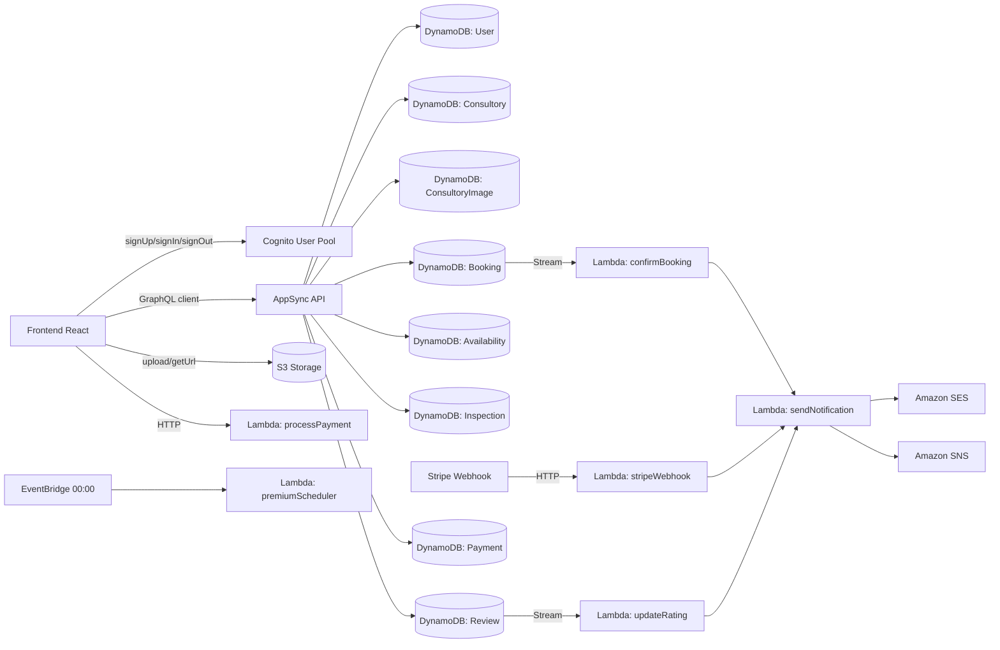
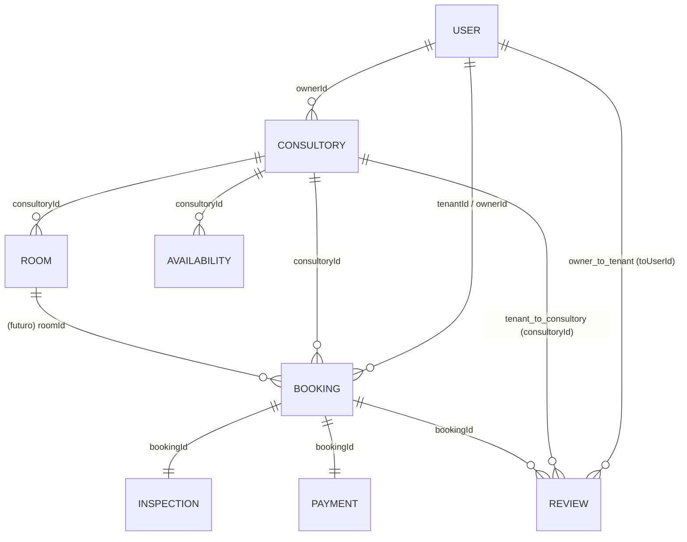

# AlugFacil - Mapa Completo do Backend (AWS Amplify Gen2)

Data de referencia: 2026-05-06

## 1) Objetivo deste documento

Este arquivo concentra todo o mapa do backend do AlugFacil em um unico lugar:

- Arquitetura backend (Amplify Gen2)
- Autenticacao (Cognito)
- Dados (AppSync + DynamoDB)
- Storage (S3)
- Lambdas de negocio
- Notificacoes (SES/SNS)
- Fluxos end-to-end
- CI/CD e deploy
- Custos iniciais e ordem recomendada de implementacao

## 2) Visao geral do produto (contexto de backend)

AlugFacil e um marketplace B2B de consultorios odontologicos com dois perfis:

- Locatario (Dentista)
- Locador (Proprietario)

Ciclo de vida principal da locacao:

```text
Busca -> Reserva -> Pagamento -> Vistoria (check-in) -> Atendimento -> Vistoria (check-out) -> Avaliacao mutua
```

## 3) Mapa visual da arquitetura backend



## 4) Por que AWS Amplify Gen2

| Tema | Gen1 | Gen2 |
|---|---|---|
| Configuracao | JSON/YAML via CLI | TypeScript puro (`amplify/backend.ts`) |
| Infraestrutura | CloudFormation auto | CDK explicito/customizavel |
| Dev local | `amplify mock` | `ampx sandbox` (nuvem real isolada) |
| Type safety | Codegen separado | Schema -> tipos automaticos |
| Deploy | `amplify push` | `ampx pipeline-deploy` / Amplify Hosting |

Servicos usados no backend AlugFacil:

- Cognito (auth)
- AppSync + DynamoDB (dados)
- Lambda (regras de negocio)
- S3 (arquivos)
- SES/SNS (notificacoes)
- Amplify Hosting (deploy frontend + pipeline backend)

## 5) Setup e bootstrap do backend

### 5.1 Pre-requisitos

```bash
node -v  # >= 18
aws configure
```

### 5.2 Dependencias

```bash
npm add -D @aws-amplify/backend @aws-amplify/backend-cli
npm add aws-amplify
npm add -D @types/node @types/aws-lambda
```

### 5.3 Estrutura base esperada

```text
alugfacil/
├── amplify/
│   ├── backend.ts
│   ├── auth/resource.ts
│   ├── data/resource.ts
│   ├── storage/resource.ts
│   └── functions/
│       ├── processPayment/
│       ├── sendNotification/
│       ├── confirmBooking/
│       ├── updateRating/
│       ├── verifyDocument/
│       ├── premiumScheduler/
│       └── stripeWebhook/
├── src/
└── amplify_outputs.json
```

### 5.4 Composicao do backend

```ts
// amplify/backend.ts
import { defineBackend } from "@aws-amplify/backend";
import { auth } from "./auth/resource";
import { data } from "./data/resource";
import { storage } from "./storage/resource";
import { processPayment } from "./functions/processPayment/resource";
import { sendNotification } from "./functions/sendNotification/resource";
import { confirmBooking } from "./functions/confirmBooking/resource";
import { updateRating } from "./functions/updateRating/resource";
import { verifyDocument } from "./functions/verifyDocument/resource";
import { premiumScheduler } from "./functions/premiumScheduler/resource";

defineBackend({
  auth,
  data,
  storage,
  processPayment,
  sendNotification,
  confirmBooking,
  updateRating,
  verifyDocument,
  premiumScheduler,
});
```

### 5.5 Sandbox dev

```bash
npx ampx sandbox
```

No frontend:

```ts
import { Amplify } from "aws-amplify";
import outputs from "../amplify_outputs.json";

Amplify.configure(outputs);
```

## 6) Autenticacao (Cognito)

### 6.1 O que o Cognito cobre

- Signup/login com email e verificacao
- JWTs (ID/Access/Refresh)
- Grupos: `TENANT`, `OWNER`, `ADMIN`
- Atributos customizados: role, CRO, especialidade, verified
- Integracao de autorizacao com AppSync

### 6.2 Exemplo de configuracao

```ts
import { defineAuth } from "@aws-amplify/backend";

export const auth = defineAuth({
  loginWith: {
    email: {
      verificationEmailStyle: "CODE",
      verificationEmailSubject: "Confirme seu cadastro no AlugFacil",
      verificationEmailBody: (createCode) => `Seu codigo de verificacao: ${createCode()}`,
    },
  },
  userAttributes: {
    email: { required: true, mutable: false },
    phoneNumber: { required: false, mutable: true },
    "custom:role": { dataType: "String", mutable: true },
    "custom:cro": { dataType: "String", mutable: true },
    "custom:specialty": { dataType: "String", mutable: true },
    "custom:verified": { dataType: "String", mutable: true },
  },
  groups: ["TENANT", "OWNER", "ADMIN"],
  passwordPolicy: {
    minLength: 8,
    requireLowercase: true,
    requireUppercase: false,
    requireNumbers: true,
    requireSpecialCharacters: false,
  },
});
```

### 6.3 Fluxo de cadastro com grupo

1. Front chama `signUp`.
2. Usuario confirma email (`confirmSignUp`).
3. Trigger `postConfirmation` adiciona no grupo certo.
4. Sistema cria/garante perfil no model `User`.
5. Sistema pode disparar email de boas-vindas.

## 7) Dados (AppSync + DynamoDB)

### 7.1 Como funciona

```text
Frontend React -> AppSync GraphQL -> Resolvers automaticos -> DynamoDB
```

O schema gera automaticamente:

- CRUD GraphQL
- Tabelas DynamoDB (1 por model)
- GSIs de relacionamentos
- Tipos TypeScript para cliente
- Regras de autorizacao

### 7.2 Relacionamento entre entidades

Regras de dominio (modelo de negocio):

- `Owner` nao e um perfil pessoal publico; ele representa um negocio.
- Cada `Owner` possui **1 consultorio (negocio)**.
- Cada consultorio possui **N salas** disponiveis para locacao.
- O `Owner` gerencia **N salas** na aba **Minhas salas**.
- Avaliacoes de locatario sao feitas para o consultorio/sala.
- Avaliacoes de owner sao feitas para o locatario.

Mapeamento no schema atual:

- O model `Consultory` representa o **consultorio (negocio/estabelecimento)** do proprietario.
- O model `Room` representa cada **sala individual** desse consultorio, disponivel para locacao.
- Cada `Consultory` pode ter N `Room`s. Cada `Room` e a unidade real anunciada, com preco, equipamentos e periodos proprios.
- `Room.ownerId` espelha `Consultory.ownerId` para que a autorizacao `ownerDefinedIn("ownerId")` funcione diretamente no model sem passar pelo consultorio pai.



### 7.3 Models e papel no dominio

| Model | PK | Relacoes principais | Papel |
|---|---|---|---|
| `User` | `cognitoId` | `Consultory`, `Booking`, `Review` | Conta de acesso (owner = conta do negocio; tenant = perfil profissional) |
| `Consultory` | `id` | `User`, `Room`, `Booking`, `Availability`, `Review` | Estabelecimento/negocio do proprietario; agrupa N salas |
| `Room` | `id` | `Consultory` | Sala individual disponivel para locacao; unidade de preco, equipamento e disponibilidade |
| `Booking` | `id` | `Consultory`, `User`, `Inspection`, `Review`, `Payment` | Reserva e ciclo de vida |
| `Inspection` | `id` | `Booking` | Check-in/check-out + evidencias |
| `Review` | `id` | `Booking`, `Consultory`, `User` | Avaliacao de locatario para consultorio/sala e de owner para locatario |
| `Payment` | `id` | `Booking` | Registro financeiro |
| `Availability` | `id` | `Consultory` | Agenda de disponibilidade |

### 7.4 Campos importantes por model

- `User`
- `cognitoId`, `name`, `publicSlug`, `email`, `phone`, `role`, `avatarKey`, `taxId`, `cro`, `specialty`, `verified`, `rating`, `totalReviews`

- `Consultory`
- `name`, `publicSlug`, `description`, `neighborhood`, `city`, `state`, `address`, `zipCode`, `latitude`, `longitude`, `pricePerPeriod`, `equipment[]`, `periodMorning`, `periodAfternoon`, `periodEvening`, `featured`, `isPremium`, `premiumUntil`, `rating`, `totalReviews`, `whatsappNumber`, `ownerId`

- `ConsultoryImage`
- `s3Key`, `order`, `consultoryId`

- `Booking`
- `date`, `period`, `status`, `price`, `platformFee`, `ownerAmount`, `reviewedByTenant`, `reviewedByOwner`, `paymentStatus`, `paymentIntentId`, `consultoryId`, `tenantId`, `ownerId`

- `Inspection`
- `type`, `checklistJson`, `photoKeys[]`, `signedAt`, `signedBy`, `bookingId`

- `Review`
- `rating`, `comment`, `type`, `fromUserId`, `toUserId`, `bookingId`, `consultoryId`
- `type=tenant_to_consultory`: avaliacao publica da sala/consultorio
- `type=owner_to_tenant`: avaliacao do locatario

- `Payment`
- `amount`, `platformFee`, `ownerAmount`, `currency`, `provider`, `providerPaymentId`, `providerChargeId`, `status`, `transferId`, `transferredAt`, `bookingId`

- `Room`
- `consultoryId`: FK para o consultorio pai
- `ownerId`: FK para o proprietario (espelha `Consultory.ownerId`; necessario para autorizacao `ownerDefinedIn`)
- `name`: nome da sala (ex.: "Sala 1", "Sala de Radiologia")
- `description`: descricao livre (opcional)
- `pricePerPeriod`: valor cobrado por periodo de locacao (float, obrigatorio)
- `equipment[]`: lista de equipamentos presentes (ex.: "Cadeira odontologica", "Raio-X")
- `imageKeys[]`: chaves S3 das fotos da sala
- `periodMorning`, `periodAfternoon`, `periodEvening`: periodos em que a sala fica disponivel
- `available`: flag de disponibilidade operacional (owner pode ativar/desativar manualmente sem apagar o registro)
- `rating`: media de avaliacoes recebidas (float, default 0)
- `totalReviews`: total de avaliacoes (int, default 0)

- `Availability`
- `consultoryId`, `date`, `period`, `isAvailable`

### 7.5 URLs publicas por slug (tenant e consultorio)

Regra de roteamento no frontend:

- `/profile` e exclusivo para o usuario autenticado (dono da conta).
- `/:slug` e rota publica generica.
- Em `/:slug`, o sistema tenta primeiro resolver `Consultory.publicSlug`.
- Se encontrar consultorio, redireciona para `/consultorios/:id`.
- Se nao encontrar consultorio, tenta resolver `User.publicSlug` de locatario (`TENANT`).
- Se nenhum registro for encontrado, exibe estado de "perfil nao encontrado".

Regra de dominio:

- Owner nao possui pagina publica pessoal em `/:slug`.
- A presenca publica do owner acontece pelo consultorio (slug do consultorio).

Observacoes de slug:

- `publicSlug` e gerado em formato URL-safe.
- Em dados legados sem slug salvo, o sistema usa fallback por nome normalizado e persiste slug ao encontrar o registro.
- Slugs reservados (ex.: `profile`, `consultorios`, `dashboard`, `entrar`) nao devem ser usados para registros publicos.

### 7.6 Autorizacao por model (resumo)

- `User`
- owner no proprio registro
- `ADMIN` com acesso administrativo
- autenticado pode ler
- leitura publica por `apiKey` para lookup de perfil publico por slug

- `Consultory`
- leitura publica por `apiKey`
- owner cria/edita/exclui
- `ADMIN` com acesso administrativo

- `ConsultoryImage`
- leitura publica por `apiKey`
- owner cria/edita/exclui
- `ADMIN` com acesso administrativo

- `Booking`
- owner-based access (tenant/owner conforme regra de identidade)
- `ADMIN` com acesso administrativo

- `Inspection`
- owner-based access
- `ADMIN` com acesso administrativo

- `Review`
- owner e tenant criam conforme ciclo de locacao
- avaliacao de consultorio pode ser lida publicamente
- `ADMIN` com acesso administrativo

- `Payment`
- owner-based access
- `ADMIN` com acesso administrativo

- `Room`
- leitura publica por `apiKey` (listagem e detalhe de sala)
- usuario autenticado pode ler (para dentistas visualizarem salas ao buscar)
- owner cria/edita/exclui via `ownerDefinedIn("ownerId")` com claim `sub` do Cognito
- campo `ownerId` e imutavel apos criacao (apenas `create` e `delete`; nao `update`)
- campo `consultoryId` tambem e imutavel (apenas `create`)
- `ADMIN` com acesso administrativo completo

- `Availability`
- leitura publica por `apiKey`
- owner cria/edita/exclui
- `ADMIN` com acesso administrativo

### 7.7 Enums de negocio

- `BookingPeriod`: `MORNING`, `AFTERNOON`, `EVENING`
- `BookingStatus`: `PENDING`, `CONFIRMED`, `CHECKED_IN`, `COMPLETED`, `CANCELLED`, `DISPUTED`
- `PaymentStatus` (Booking): `PENDING`, `PAID`, `REFUNDED`
- `AvailabilityPeriod`: `MORNING`, `AFTERNOON`, `EVENING`
- `InspectionType`: `CHECK_IN`, `CHECK_OUT`
- `ReviewType`: `TENANT_TO_CONSULTORY`, `OWNER_TO_TENANT`
- `PaymentProvider`: `STRIPE`, `PAGARME`
- `PaymentRecordStatus`: `PENDING`, `PROCESSING`, `PAID`, `FAILED`, `REFUNDED`

### 7.8 GSIs recomendados

| Tabela | GSI | Partition Key | Sort Key | Uso |
|---|---|---|---|---|
| Booking | byTenant | tenantId | date | Reservas do dentista |
| Booking | byOwner | ownerId | date | Reservas do proprietario |
| Booking | byConsultory | consultoryId | date | Agenda do consultorio |
| Booking | byStatus | status | date | Operacao admin |
| Consultory | byCity | city | neighborhood | Busca por localizacao |
| Consultory | byOwner | ownerId | createdAt | Consultorios do proprietario |
| Room | byConsultory | consultoryId | createdAt | Salas de um consultorio |
| Room | byOwner | ownerId | createdAt | Todas as salas de um proprietario (multi-consultorio) |
| Availability | byConsultory | consultoryId | date | Disponibilidade |

### 7.9 Cliente frontend para dados reais

```ts
import { generateClient } from "aws-amplify/data";
import type { Schema } from "../../amplify/data/resource";

export const client = generateClient<Schema>();

export const listConsultories = () =>
  client.models.Consultory.list({ authMode: "apiKey" });

export const createBooking = (input: {
  consultoryId: string;
  date: string;
  period: "MORNING" | "AFTERNOON" | "EVENING";
  price: number;
}) =>
  client.models.Booking.create({
    ...input,
    status: "PENDING",
    paymentStatus: "PENDING",
    reviewedByTenant: false,
    reviewedByOwner: false,
  });
```

### 7.10 Gerenciamento de salas (`Room`) — Minhas Salas

Esta secao detalha o ciclo completo de CRUD de salas no contexto do proprietario, incluindo schema, API frontend, regras de negocio e a tela `/dashboard/proprietario/salas`.

#### 7.10.1 Schema no Amplify Data

```ts
Room: a.model({
  consultoryId: a.id().required(),         // FK imutavel — aponta para o Consultory pai
  consultory: a.belongsTo("Consultory", "consultoryId"),
  ownerId: a.string().required(),           // FK imutavel — espelha Consultory.ownerId
  name: a.string().required(),             // ex.: "Sala 1", "Sala de Implantes"
  description: a.string(),                 // descricao livre (opcional)
  pricePerPeriod: a.float().required(),    // valor por periodo (manha/tarde/noite)
  equipment: a.string().array(),           // ["Cadeira odontologica", "Raio-X", ...]
  imageKeys: a.string().array(),           // chaves S3 das fotos da sala
  periodMorning: a.boolean().default(false),
  periodAfternoon: a.boolean().default(false),
  periodEvening: a.boolean().default(false),
  available: a.boolean().default(true),    // flag operacional: owner ativa/desativa sem apagar
  rating: a.float().default(0),
  totalReviews: a.integer().default(0),
})
```

Autorizacao no schema:

| Campo | apiKey (publico) | ownerDefinedIn("ownerId") | ADMIN |
|---|---|---|---|
| `consultoryId` | read | create, read, delete | all |
| `ownerId` | read | create, read, delete | all |
| `name` | read | create, read, update, delete | all |
| `description` | (implicit) | create, read, update, delete | all |
| `pricePerPeriod` | read | create, read, update, delete | all |
| Nivel do model | read | create, read, update, delete | all |

Regra critica: `ownerId` e `consultoryId` sao imutaveis apos criacao. O claim `sub` do Cognito e comparado com `ownerId` para autorizar operacoes de escrita.

#### 7.10.2 API frontend — `src/lib/api/rooms.ts`

Todas as funcoes usam `authMode: "userPool"` (padrao) para mutacoes e `authMode: "apiKey"` para leitura publica.

```ts
// Listar salas de um consultorio (leitura publica)
export async function listRoomsByConsultory(consultoryId: string): Promise<Room[]>

// Criar sala (requer autenticacao como owner)
export async function createRoom(input: CreateRoomInput): Promise<Room>

// Atualizar sala — aceita subconjunto dos campos editaveis + toggle de disponibilidade
export async function updateRoom(
  id: string,
  fields: Partial<{
    name: string;
    description?: string;
    pricePerPeriod: number;
    equipment: string[];
    periodMorning: boolean;
    periodAfternoon: boolean;
    periodEvening: boolean;
    available: boolean;   // adicionado para suporte ao toggle de disponibilidade
  }>
): Promise<void>

// Apagar sala (requer autenticacao como owner)
export async function deleteRoom(id: string): Promise<void>
```

Interface `CreateRoomInput`:

```ts
interface CreateRoomInput {
  consultoryId: string;
  ownerId: string;
  name: string;
  description?: string;
  pricePerPeriod: number;
  equipment: string[];
  periodMorning: boolean;
  periodAfternoon: boolean;
  periodEvening: boolean;
}
```

Interface `Room` (tipo frontend, mapeado de `mapBackendRoom`):

```ts
interface Room {
  id: string;
  consultoryId: string;
  ownerId: string;
  name: string;
  description?: string;
  pricePerPeriod: number;
  equipment: string[];
  imageKeys?: string[];
  images: string[];       // URLs resolvidas (fallback para imagem padrao se imageKeys vazio)
  periods: {
    morning: boolean;
    afternoon: boolean;
    evening: boolean;
  };
  available: boolean;
  rating: number;
  totalReviews: number;
  createdAt: string;
}
```

#### 7.10.3 Tela `Minhas Salas` — `/dashboard/proprietario/salas`

Rota: `/dashboard/proprietario/salas` (protegida por `OwnerOnlyRoute`)
Componente: `src/pages/dashboard/OwnerRooms.tsx`

Fluxo de carregamento:

```text
1. useEffect dispara ao montar ou ao mudar currentUser.id
2. listConsultoriesByOwner(ownerId) — carrega todos os consultorios do owner
3. Para cada consultorio, listRoomsByConsultory(consultoryId) em paralelo (Promise.all)
4. Rooms sao achatados (flat) em um unico array de estado
5. primaryConsultory = consultories[0] — usado como contexto para criar novas salas
```

Acoes disponiveis na tela:

| Acao | Comportamento |
|---|---|
| **Adicionar sala** | Abre `CreateRoomModal` (nome, descricao, preco, periodos, equipamentos); ao confirmar, chama `createRoom` e insere no estado local |
| **Editar sala** | Abre `EditRoomModal` pre-preenchido com dados da sala; ao confirmar, chama `updateRoom` e substitui o item no estado local |
| **Ativar / Desativar** | Toggle inline no card; chama `updateRoom(id, { available: !room.available })`; atualiza estado local sem reload |
| **Apagar sala** | Confirmacao inline no proprio card (sem modal extra); chama `deleteRoom` e remove do estado local |

Stats exibidas no topo:

- Total de salas
- Salas disponíveis (`available = true`)
- Salas indisponíveis (`available = false`)

Sidebar: o item "Minhas salas" fica ativo (`bg-primary-50 text-primary-600`) quando `location.pathname === "/dashboard/proprietario/salas"`, pois o `DashboardLayout` compara a rota atual com `navItem.path`.

#### 7.10.4 Modais de sala

**`CreateRoomModal`** (`src/components/modals/CreateRoomModal.tsx`):
- Estado limpo; todos os campos comecam vazios/false
- Validacoes: nome obrigatorio, preco > 0, ao menos 1 periodo selecionado
- Chama `createRoom(input)`; propaga o `Room` criado via `onCreated(room)`

**`EditRoomModal`** (`src/components/modals/EditRoomModal.tsx`):
- Estado inicializado com os dados da sala recebida via prop `room: Room`
- Mesmas validacoes do modal de criacao
- Chama `updateRoom(room.id, { ... })`; propaga o `Room` atualizado (construido localmente a partir da resposta) via `onUpdated(room)`
- Nao atualiza `available`, `imageKeys`, `rating` ou `totalReviews` — esses campos tem fluxos proprios

#### 7.10.5 Regras de negocio e invariantes

- Uma sala sempre pertence a exatamente 1 consultorio (`consultoryId` imutavel).
- `ownerId` da sala DEVE ser identico a `ownerId` do consultorio pai — o frontend garante isso ao criar (`ownerId: currentUser.id`).
- Apagar uma sala nao cancela bookings existentes para ela — em versoes futuras, deve-se verificar reservas pendentes antes de permitir exclusao.
- O campo `available = false` e a forma correta de "pausar" uma sala sem perder historico. Apagar e irreversivel.
- Em telas publicas (listagem de consultorios), apenas salas com `available = true` devem ser exibidas como disponiveis para reserva.
- `rating` e `totalReviews` da sala sao gerenciados pela Lambda `updateRating` (stream de `Review`) — nunca pelo frontend diretamente.

#### 7.10.6 Evolucao futura de salas

- **Vincular `Booking` a `Room`**: adicionar campo `roomId` optional em `Booking` para rastrear qual sala especifica foi reservada dentro de um consultorio com multiplas salas.
- **Disponibilidade por sala**: o model `Availability` hoje aponta para `consultoryId`; quando o consultorio tiver N salas, devera incluir `roomId` para granularidade fina.
- **Fotos por sala**: upload de `imageKeys[]` via S3 (fluxo analogo ao de fotos do consultorio), com bucket `room-images/{ownerId}/{roomId}/*`.
- **Precificacao dinamica**: `pricePerPeriod` atual e unico por sala; uma evolucao pode ter preco diferenciado por periodo (manha/tarde/noite).

## 8) Storage (S3)

### 8.1 Buckets logicos

| Bucket logico | Conteudo | Acesso |
|---|---|---|
| `consultory-images` | Fotos de consultorios | Leitura publica; escrita do dono |
| `inspection-photos` | Fotos de vistoria | Leitura/escrita dos envolvidos |
| `avatars` | Foto de perfil | Leitura publica; escrita do proprio |
| `documents` | CRO/CNPJ/comprovantes | Privado (usuario + admin) |

### 8.2 Politicas de acesso

```ts
import { defineStorage } from "@aws-amplify/backend";

export const storage = defineStorage({
  name: "alugfacilStorage",
  access: (allow) => ({
    "consultory-images/{entity_id}/*": [
      allow.guest.to(["read"]),
      allow.entity("identity").to(["read", "write", "delete"]),
    ],
    "inspection-photos/{entity_id}/*": [
      allow.entity("identity").to(["read", "write", "delete"]),
      allow.groups(["ADMIN"]).to(["read"]),
    ],
    "avatars/{entity_id}/*": [
      allow.guest.to(["read"]),
      allow.entity("identity").to(["read", "write", "delete"]),
    ],
    "documents/{entity_id}/*": [
      allow.entity("identity").to(["read", "write"]),
      allow.groups(["ADMIN"]).to(["read", "write"]),
    ],
  }),
});
```

### 8.3 Operacoes comuns de upload/url

```ts
import { uploadData, getUrl } from "aws-amplify/storage";

export async function uploadConsultoryImage(file: File, consultoryId: string) {
  const key = `consultory-images/${consultoryId}/${Date.now()}-${file.name}`;
  await uploadData({ key, data: file, options: { contentType: file.type } }).result;
  return key;
}

export async function getImageUrl(key: string) {
  const result = await getUrl({ key, options: { expiresIn: 3600 } });
  return result.url.toString();
}
```

## 9) Funcoes Lambda (logica de negocio)

### 9.1 Matriz de funcoes

| Funcao | Trigger | Responsabilidade |
|---|---|---|
| `processPayment` | HTTP (API Gateway) | Criar intent no Stripe e iniciar cobranca |
| `confirmBooking` | DynamoDB Stream (Booking criado) | Notificar proprietario |
| `sendNotification` | Invocacao direta + SES/SNS | Envio de emails/push |
| `updateRating` | DynamoDB Stream (Review criada) | Recalcular medias |
| `verifyDocument` | HTTP (admin) | Verificar usuario/documentos |
| `premiumScheduler` | EventBridge diario 00:00 | Rebaixar premium expirado |
| `stripeWebhook` | HTTP (Stripe) | Confirmar pagamento e atualizar booking |

### 9.2 Exemplo de resource

```ts
import { defineFunction, secret } from "@aws-amplify/backend";

export const processPayment = defineFunction({
  name: "processPayment",
  entry: "./handler.ts",
  runtime: 20,
  timeoutSeconds: 30,
  environment: {
    STRIPE_SECRET_KEY: secret("STRIPE_SECRET_KEY"),
    PLATFORM_FEE_PERCENT: "10",
  },
});
```

```ts
import { defineFunction } from "@aws-amplify/backend";
import { Schedule } from "aws-cdk-lib/aws-events";

export const premiumScheduler = defineFunction({
  name: "premiumScheduler",
  entry: "./handler.ts",
  schedule: Schedule.cron({ hour: "0", minute: "0" }),
});
```

### 9.3 Exemplo `processPayment` (Stripe)

- Recebe `bookingId`, `amount`, `ownerStripeAccountId`
- Calcula fee da plataforma (`PLATFORM_FEE_PERCENT`)
- Cria `paymentIntent` com `application_fee_amount` e `transfer_data.destination`
- Retorna `clientSecret` para Stripe Elements no frontend

### 9.4 Exemplo `stripeWebhook`

- Valida assinatura (`STRIPE_WEBHOOK_SECRET`)
- Evento `payment_intent.succeeded`
- Atualiza `Booking.paymentStatus = PAID` e `Booking.status = CONFIRMED`
- Dispara notificacoes para as partes

### 9.5 Exemplo `updateRating`

- Consome stream de `Review` (INSERT)
- Recalcula media de `User` e `Consultory`
- Atualiza `rating` e `totalReviews`

### 9.6 Exemplo `premiumScheduler`

- Procura `Consultory` com `isPremium = true` e `premiumUntil < now`
- Atualiza `isPremium = false` e `featured = false`

## 10) Notificacoes (SES + SNS)

### 10.1 Eventos que disparam notificacao

| Evento | Destinatario | Canal |
|---|---|---|
| Nova reserva criada | Proprietario | Email |
| Reserva confirmada | Dentista | Email + Push |
| Reserva cancelada | Ambos | Email |
| Pagamento confirmado | Dentista + Proprietario | Email |
| Avaliacao recebida | Usuario avaliado | Email |
| Vistoria pendente | Ambos | Email + Push |
| Premium expirando (3 dias) | Proprietario | Email |

### 10.2 Observacoes SES

- Em sandbox do SES, so emails verificados podem receber.
- Em producao, verificar dominio (`alugfacil.com.br`) para envio em escala.

### 10.3 Exemplo de templates

`sendNotification` usa `templateId` (ex.: `NEW_BOOKING`, `BOOKING_CONFIRMED`, `PAYMENT_CONFIRMED`, `NEW_REVIEW`) + payload dinamico para compor assunto e HTML.

## 11) Fluxos end-to-end

### 11.1 Agendamento + pagamento

```text
1. Dentista cria Booking (PENDING)
2. Stream dispara confirmBooking
3. Proprietario e notificado
4. Proprietario confirma reserva
5. Front chama processPayment
6. Stripe processa e chama stripeWebhook
7. stripeWebhook marca PAID/CONFIRMED
8. sendNotification confirma para ambos
```

### 11.2 Vistoria

```text
1. Check-in no InspectionModal
2. Upload de fotos no S3
3. Criacao de Inspection com photoKeys/checklistJson
4. Booking -> CHECKED_IN
5. Repeticao no check-out
6. Booking -> COMPLETED
```

### 11.3 Avaliacao

```text
1. Usuario envia Review
2. Stream dispara updateRating
3. Medias de usuario e consultorio sao recalculadas
4. Notificacao enviada ao avaliado
```

## 12) CI/CD e hospedagem

### 12.1 Branches

| Branch | Ambiente | URL |
|---|---|---|
| `main` | Producao | `alugfacil.com.br` |
| `develop` | Staging | `dev.alugfacil.com.br` |
| `feature/*` | Preview por PR | URL temporaria |

### 12.2 `amplify.yml`

```yaml
version: 1
backend:
  phases:
    build:
      commands:
        - npm ci
        - npx ampx pipeline-deploy --branch $AWS_BRANCH --app-id $AWS_APP_ID
frontend:
  phases:
    preBuild:
      commands:
        - npm ci
        - npx ampx generate outputs --branch $AWS_BRANCH --app-id $AWS_APP_ID
    build:
      commands:
        - npm run build
  artifacts:
    baseDirectory: dist
    files:
      - "**/*"
  cache:
    paths:
      - node_modules/**/*
```

### 12.3 Secrets

```bash
npx ampx sandbox secret set STRIPE_SECRET_KEY
npx ampx sandbox secret set STRIPE_WEBHOOK_SECRET
```

No Amplify Console (producao), espelhar as mesmas variaveis em `Environment Variables`.

## 13) Diagrama macro (ASCII)

```text
Frontend (React/Vite em Amplify Hosting + CloudFront)
   |- Cognito (Auth)
   |- AppSync (GraphQL)
   |    `- DynamoDB (models)
   |          `- Streams -> Lambdas (confirmBooking / updateRating)
   |- S3 (assets e evidencias)
   |- Lambdas HTTP (processPayment / stripeWebhook / verifyDocument)
   `- Notificacao (sendNotification -> SES/SNS)
```

## 14) Estimativa de custos (referencia inicial)

| Servico | Free Tier | Custo aprox (1.000 usuarios/mes) |
|---|---|---|
| Cognito | 50.000 MAU gratis | $0 |
| AppSync | 250.000 req/mes gratis | ~$4/mes |
| DynamoDB | 25 GB + 200M req gratis | $0-$5/mes |
| Lambda | 1M invocacoes gratis | $0 |
| S3 | 5 GB gratis | ~$1/mes |
| SES | 62.000 emails/mes gratis (via EC2/Lambda) | $0 |
| Amplify Hosting | 1.000 build min/mes gratis | $0-$2/mes |
| Total estimado | | ~$5-$12/mes |

## 15) Ordem recomendada de implementacao

```text
Fase 1 (Fundacao)
  - Amplify Gen2 + Cognito + User/Consultory
  - Trocar AuthContext mock
  - Trocar listagens mock por dados reais

Fase 2 (Reservas)
  - Booking + Availability
  - confirmBooking + sendNotification
  - Dashboards reais

Fase 3 (Pagamentos)
  - processPayment + stripeWebhook
  - Fluxo Stripe completo no booking

Fase 4 (Vistoria + Avaliacao)
  - S3 para fotos
  - Inspection + Review
  - updateRating

Fase 5 (Premium + Admin)
  - premiumScheduler
  - verifyDocument
  - Admin dashboard com dados reais
```

## 16) Onde editar ao evoluir backend

- Auth/Cognito: `amplify/auth/resource.ts`
- Schema e autorizacao: `amplify/data/resource.ts`
- Storage S3: `amplify/storage/resource.ts`
- Composicao do backend: `amplify/backend.ts`
- Lambdas: `amplify/functions/*`
- Integracao frontend de dados: `src/data/api.ts`
- Integracao frontend de storage: `src/utils/storage.ts`

## 17) Diagnostico de implementacao real (2026-05-11)

Comparando este mapa com o codigo atual do projeto, os seguintes pontos de locacao estavam ausentes ou incompletos:

1. **Fechamento de locacao sem gatilho de status**
- O fluxo de vistoria marcava apenas `inspectedCheckIn/inspectedCheckOut`, mas nao marcava a reserva como `completed`.
- Impacto: o "fim da locacao" nao ficava explicitamente registrado no ciclo do `Booking`.

2. **Avaliacao sem regra server-side de elegibilidade**
- `Review` podia ser criada diretamente por qualquer usuario autenticado.
- Nao havia validacao de:
  - participante da locacao (tenant/owner do booking)
  - locacao finalizada
  - prevencao de dupla avaliacao pela mesma parte

3. **Modelo de Booking sem timestamp de encerramento**
- Nao havia campo para registrar data/hora exata do encerramento da locacao.
- Foi adicionado `completedAt` para explicitar o fim do contrato naquele booking.

4. **Exposicao publica de avaliacao indevida**
- A listagem publica de avaliacoes por consultorio nao filtrava por tipo.
- Ajuste necessario: exibir publicamente apenas `tenant_to_consultory`.

Evolucao aplicada para cobrir esses gaps:

- Nova mutation customizada `submitBookingReview` (AppSync + Lambda handler) em `amplify/data/resource.ts`.
- Regra centralizada no backend: review so e criada quando `Booking.status=completed` **e** `inspectedCheckOut=true`.
- Restricao de participacao: somente `tenantId` ou `ownerId` do booking autenticado pode avaliar.
- Prevencao de duplicidade por parte (`reviewedByTenant` / `reviewedByOwner`).
- Bloqueio de criacao direta de `Review` por cliente autenticado comum (mantendo leitura).

## 18) Evolucao: Agendamento por Dia Completo (2026-05-13)

### 18.1 Regra de dominio

Cada locacao ocupa **um dia inteiro** de uma sala. Nao ha separacao de periodo dentro de um mesmo dia para efeito de reserva.

Restricao de unicidade:
- Apenas **1 `Booking` ativo** por `(roomId, date)`.
- Status considerados ativos para o bloqueio: `PENDING`, `CONFIRMED`, `CHECKED_IN`.
- `CANCELLED` e `COMPLETED` liberam o slot para novas reservas.

### 18.2 Mudancas no schema `Booking`

| Campo | Antes | Depois | Observacao |
|---|---|---|---|
| `roomId` | opcional / ausente | **obrigatorio** | Identifica exatamente qual sala e reservada |
| `period` | obrigatorio (`MORNING/AFTERNOON/EVENING`) | **deprecado** | Mantido no schema por retrocompatibilidade mas nao usado para calcular disponibilidade |
| `date` | `String` | `String` (YYYY-MM-DD) | Representa o dia inteiro |

Schema atualizado:

```ts
Booking: a.model({
  roomId: a.id().required(),          // sala reservada (obrigatorio a partir desta versao)
  room: a.belongsTo("Room", "roomId"),
  consultoryId: a.id().required(),
  consultoryName: a.string().required(),
  consultoryImage: a.string(),
  tenantId: a.string().required(),
  tenantName: a.string().required(),
  ownerId: a.string().required(),
  ownerName: a.string(),
  date: a.string().required(),        // YYYY-MM-DD — ocupa o dia todo
  period: a.enum(["MORNING", "AFTERNOON", "EVENING"]),  // deprecado
  status: a.enum(["PENDING", "CONFIRMED", "CHECKED_IN", "COMPLETED", "CANCELLED", "DISPUTED"]).required(),
  price: a.float().required(),
  platformFee: a.float(),
  ownerAmount: a.float(),
  paymentStatus: a.enum(["PENDING", "PAID", "REFUNDED"]).default("PENDING"),
  paymentIntentId: a.string(),
  reviewedByTenant: a.boolean().default(false),
  reviewedByOwner: a.boolean().default(false),
  inspectedCheckIn: a.boolean().default(false),
  inspectedCheckOut: a.boolean().default(false),
  completedAt: a.string(),
})
```

### 18.3 GSIs adicionados/atualizados

| Tabela | GSI | Partition Key | Sort Key | Uso |
|---|---|---|---|---|
| Booking | byRoom | roomId | date | Verificar conflito de slot (roomId + date) |
| Availability | byRoom | roomId | date | Disponibilidade por sala e dia |

O GSI `byRoom` e o ponto central de validacao de conflito: para saber se uma sala esta disponivel em determinado dia, basta consultar `Booking.byRoom(roomId).date = date` filtrando por status ativo.

### 18.4 Logica de validacao de conflito (Lambda `validateBookingSlot`)

Antes de criar ou confirmar um `Booking`, a Lambda (ou inline no `confirmBooking`) executa:

```ts
// Pseudocodigo da validacao de conflito
async function validateBookingSlot(roomId: string, date: string): Promise<void> {
  const conflicting = await client.models.Booking.list({
    indexName: "byRoom",
    filter: {
      roomId: { eq: roomId },
      date: { eq: date },
      status: { in: ["PENDING", "CONFIRMED", "CHECKED_IN"] },
    },
    limit: 1,
  });

  if (conflicting.data.length > 0) {
    throw new Error("Sala ja reservada para este dia.");
  }
}
```

Esta validacao deve ser executada:
1. Ao criar um novo `Booking` (status `PENDING`)
2. Ao confirmar um `Booking` pendente (status `CONFIRMED`) — pois outro tenant pode ter criado um PENDING no mesmo slot enquanto o owner ainda nao confirmou

### 18.5 Evolucao do model `Availability`

O model `Availability` passa a ter granularidade de dia por sala (nao mais por periodo):

```ts
Availability: a.model({
  roomId: a.id().required(),     // sala (nivel granular; substitui consultoryId como PK logica)
  consultoryId: a.id().required(), // mantido para buscas por consultorio
  date: a.string().required(),   // YYYY-MM-DD
  isAvailable: a.boolean().default(true),
})
```

Regra: um dia com `isAvailable = false` bloqueia a sala independentemente de nao haver `Booking` — util para feriados, manutencao e bloqueios manuais pelo proprietario.

Hierarquia de disponibilidade do dia:
```text
1. Availability.isAvailable = false  →  bloqueado (manualmente pelo owner)
2. Booking ativo para roomId + date  →  bloqueado (locacao em andamento)
3. Caso contrario                    →  disponivel para reserva
```

### 18.6 Frontend: verificar disponibilidade antes de criar reserva

```ts
// src/lib/api/bookings.ts
export async function isRoomAvailableOnDate(
  roomId: string,
  date: string
): Promise<boolean> {
  const api = getClient();

  // 1. Verificar bloqueio manual de disponibilidade
  const availability = await api.models.Availability.list({
    filter: {
      roomId: { eq: roomId },
      date: { eq: date },
      isAvailable: { eq: false },
    },
    limit: 1,
    authMode: "apiKey",
  });
  if (availability.data.length > 0) return false;

  // 2. Verificar booking ativo existente
  const conflict = await api.models.Booking.list({
    filter: {
      roomId: { eq: roomId },
      date: { eq: date },
      status: { in: ["PENDING", "CONFIRMED", "CHECKED_IN"] },
    },
    limit: 1,
  });
  return conflict.data.length === 0;
}
```

### 18.7 Impacto no dashboard do locatario

- **Reservas ativas**: filtro `status IN [pending, confirmed, checked_in]` — sem alteracao.
- **Proxima reserva**: ordenar por `date ASC`, pegar o primeiro item com `date >= hoje`. Exibir nome do consultorio e a data da reserva.
- **Periodo (period)**: removido das visualizacoes de cartao. Mantido internamente no modelo por retrocompatibilidade mas nao exibido ao usuario final.

### 18.8 Fluxo de criacao de reserva (atualizado)

```text
1. Tenant seleciona sala + data no calendario
2. Frontend chama isRoomAvailableOnDate(roomId, date)
3. Se disponivel: createBooking({ roomId, consultoryId, date, price, ... })
4. Lambda confirmBooking dispara:
   a. validateBookingSlot(roomId, date) — segunda verificacao server-side
   b. Se conflito: Booking -> CANCELLED + notifica tenant
   c. Se livre: notifica owner para confirmar
5. Owner confirma: Booking -> CONFIRMED
6. Ciclo de vistoria + avaliacao segue normalmente
```
